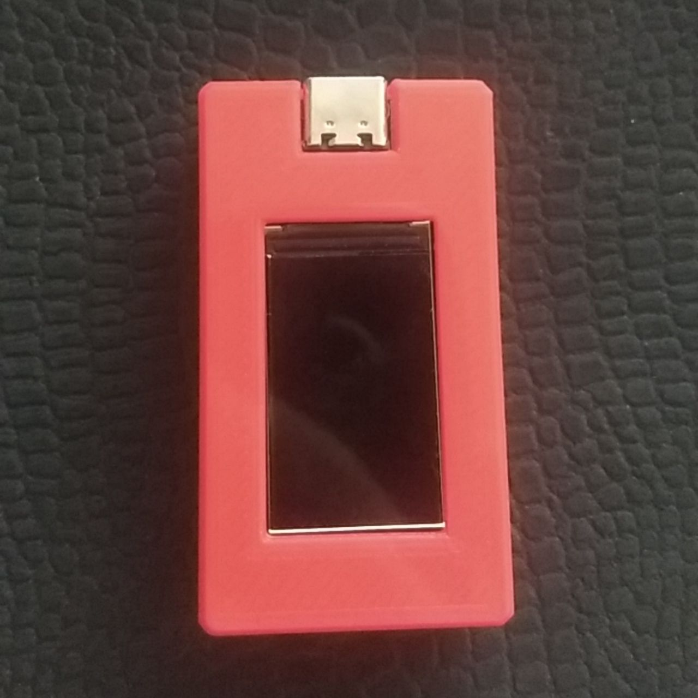
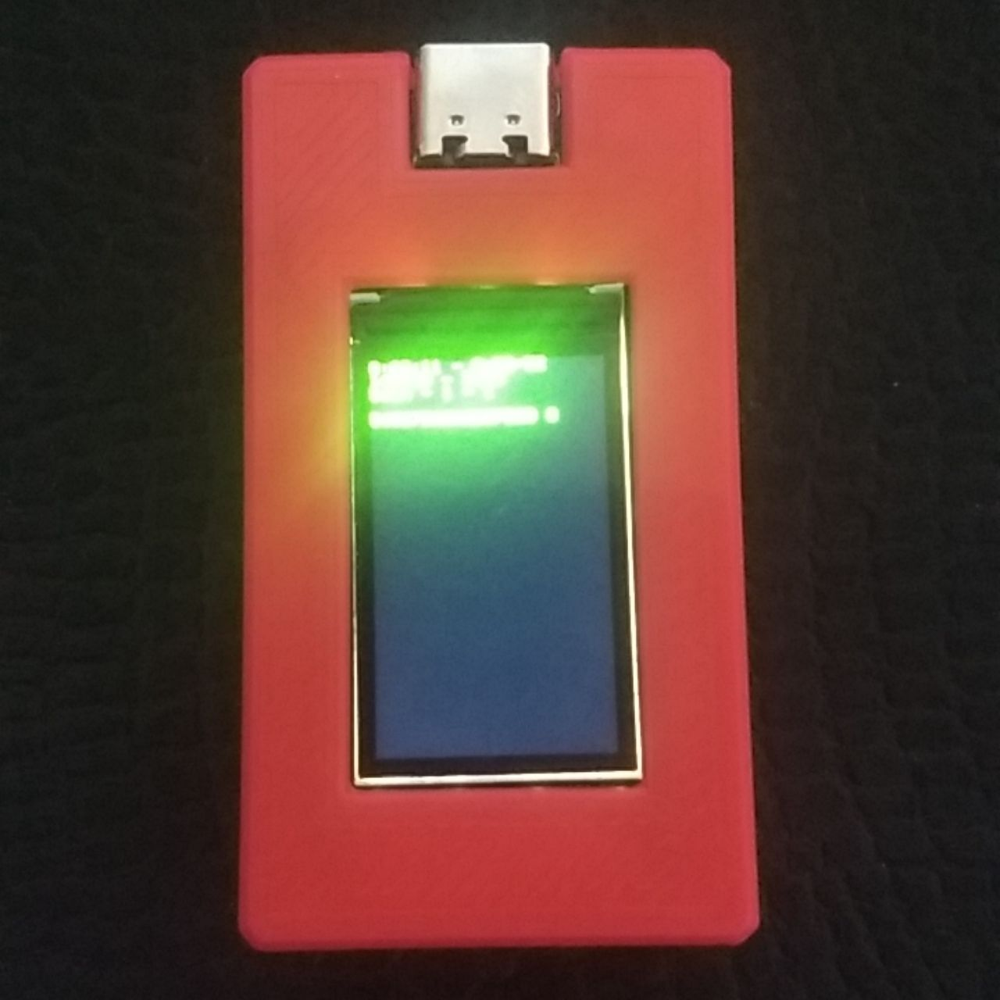
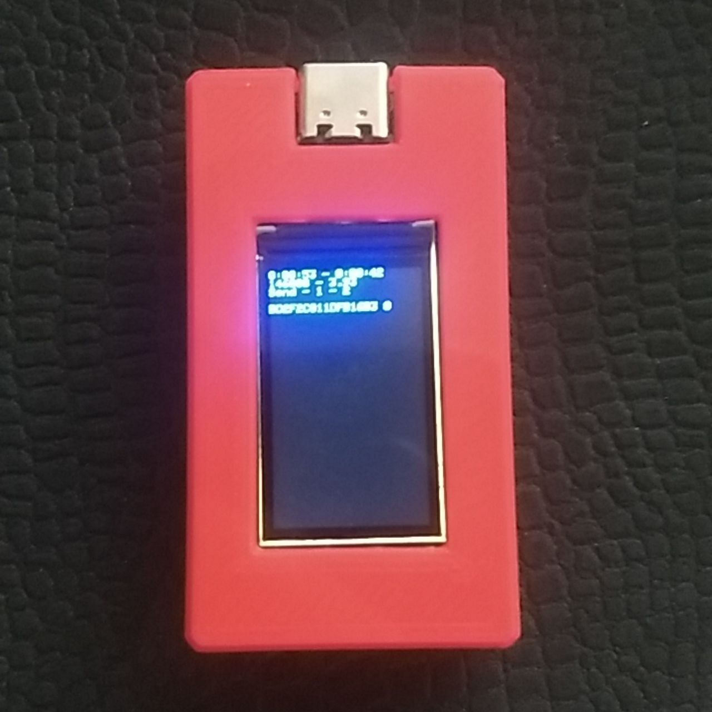

# esp32-ble-copy

This code scans the BLE and records the data for the LinkedIn Bluetooth nearby application.

### Board

- [TTGO-T-Display][1]

### Dependency Library

- [TFT_eSPI](https://github.com/Bodmer/TFT_eSPI) (Don't need to change the `User_Setup.h`)
- [Button2](https://github.com/LennartHennigs/Button2)

### Button 1 (gpio35) 

- `Simple` click set the sleep timeout 60 second
- `Double` click set the sleep timeout 300 second
- `Triple` click set the sleep timeout 600 second
- `Long` click go to sleep

### Button 2 (gpio0) 

- `Simple` change to send/scan mode
- `Double` add 1 random data
- `Triple` add 10 random data
- `Long` click go to sleep

---

[1]: https://github.com/Xinyuan-LilyGO/TTGO-T-Display